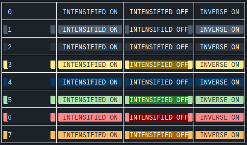

# Cores no ABAP
```abap
REPORT zprog_006_00.  " LINE-SIZE 70 LINE-COUNT 5.

TABLES: zprodutos_00,  "referência para a tabela z de produtos
        zestoque_00.    "Referência para a tabela z de estoques

"Tipo para estoques
TYPES: BEGIN OF ty_estoque,
         produto    TYPE zproduto_00,
         "descricao  TYPE zdesc_produto_00,
         quantidade TYPE zquantidade_00,
         unidade    TYPE zunidade_00,
       END OF ty_estoque.

"Estrutura e tabela interna
DATA: lt_estoque TYPE TABLE OF ty_estoque,
      ls_estoque LIKE LINE OF lt_estoque,
      ls_produto TYPE zprodutos_e_00,
      lt_produto TYPE TABLE OF zprodutos_e_00.


"Seleção de banco de dados para uma tabela interna
*SELECT zestoque_00~produto
*       desc_produto
*       quantidade
*       unidade
*  FROM zestoque_00
*  INNER JOIN zprodutos_00 ON zestoque_00~produto = zprodutos_00~produto
*  INTO TABLE lt_estoque.

*SELECT produto
*       descricao
*       quantidade
*       unidade
*  FROM zestoque_v_00
*  INTO TABLE lt_estoque.

*SELECT produto
*       "descricao
*       quantidade
*       unidade
*  FROM zestoque_00
*  INTO TABLE lt_estoque.
*  "WHERE produto <= '3'.
*
*SELECT produto
*       desc_produto
*       preco
*  FROM zprodutos_00
*  INTO CORRESPONDING FIELDS OF TABLE lt_produto
*  FOR ALL ENTRIES IN lt_estoque
*  WHERE produto = lt_estoque-produto.
*
*LOOP AT lt_estoque INTO ls_estoque.
*
*  READ TABLE lt_produto INTO ls_produto WITH KEY produto = ls_estoque-produto.
*  IF sy-subrc <> 0.
*    ls_produto-desc_produto = 'Produto não encontrado.'.
*  ENDIF.
*
*  WRITE: / ls_estoque-produto, ls_produto-desc_produto, ls_estoque-quantidade, ls_estoque-unidade, ls_produto-preco.
*
*ENDLOOP.


*  Aqui tem o exemplo dado pela própria SAP, que abrange todos os efeitos
* e todas as cores
DATA col TYPE i VALUE 0.

WRITE: / sy-uline(63).
DO 8 TIMES.
  col = sy-index - 1.
  FORMAT COLOR = col.
  WRITE: / '|', col USING EDIT MASK '__' COLOR OFF,
           '|', 'INTENSIFIED ON'  INTENSIFIED ON,
           '|', 'INTENSIFIED OFF'  INTENSIFIED OFF,
           '|', 'INVERSE ON', '|'      INVERSE ON.
  WRITE: / sy-uline(63).
ENDDO.
```
<p align="center">
  
</p>

